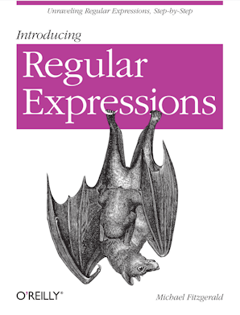
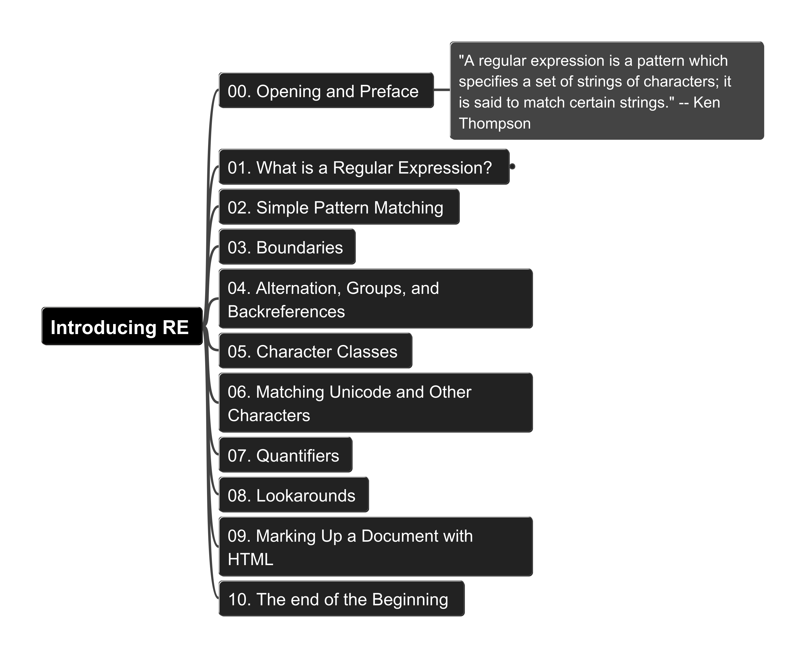
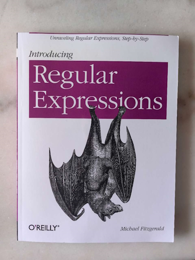
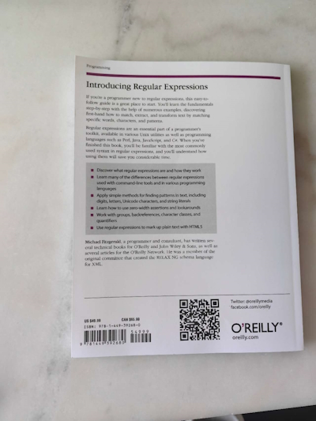

# Introducing Regular Expressions

Author: Michael Fitzgerald (Published by O'REILLY)

## Get the Book (Click to O'REILLY)

## Content Structure

## Related Tools and Resources for Regular Expression

- [RegEx Pal](https://www.regexpal.com/): online Regular Expression editer and validator, from Steven Levithan (Now from Dan's tools)
- [RegExr.com](https://regexr.com/): from Grant Skinner
- [Regex Workbench (VS Code Extension)](https://marketplace.visualstudio.com/items?itemName=robinbentley.vscode-regex-workbench): from Robin Bentley

## Jump to the Source Code per Sub-Chapter

| ch01 | ch02 | ch03 | ch04 | ch05 | ch06 | ch07 | ch08 | ch09 | ch10 |
| --- | --- | --- | --- | --- | --- | --- | --- | --- | --- |
| [01-01](ch01/01-01.md) | [02-01](ch02/02-01.md) | | | | | | | | |
| [01-02](ch01/01-02.md) | [02-02](ch02/02-02.md) | | | | | | | | |
| [01-03](ch01/01-03.md) | [02-03](ch02/02-03.md) | | | | | | | | |
| [01-04](ch01/01-04.md) | | | | | | | | | |
| [01-05](ch01/01-05.md) | | | | | | | | | |
| [01-06](ch01/01-06.md) | | | | | | | | | |
| [01-07](ch01/01-07.md) | | | | | | | | | |
| [01-08](ch01/01-08.md) | | | | | | | | | |

## Jump to Chapter's README

- [Chapter 01: What Is a Regular Expression?](ch01/README.md)
- [Chapter 02: Simple Pattern Matching](ch02/README.md)
- [Chapter 03: Boundaries](ch03/README.md)
- [Chapter 04: Alternation, Groups, and Backreferences](ch04/README.md)
- [Chapter 05: Character Classes](ch05/README.md)
- [Chapter 06: Matching Unicode and Other Characters](ch06/README.md)
- [Chapter 07: Quantifiers](ch07/README.md)
- [Chapter 08: Lookarounds](ch08/README.md)
- [Chapter 09: Marking Up a Document with HTML](ch09/README.md)
- [Chapter 10: The end of the Beginning](ch10/README.md)

## My Hard-Copy Book

Arrived at Apr 30, 2025 :satisfied:

|  |  |
| --- | --- |

---

Welcome to hear your opinion and comments, post in Discussion Board please.