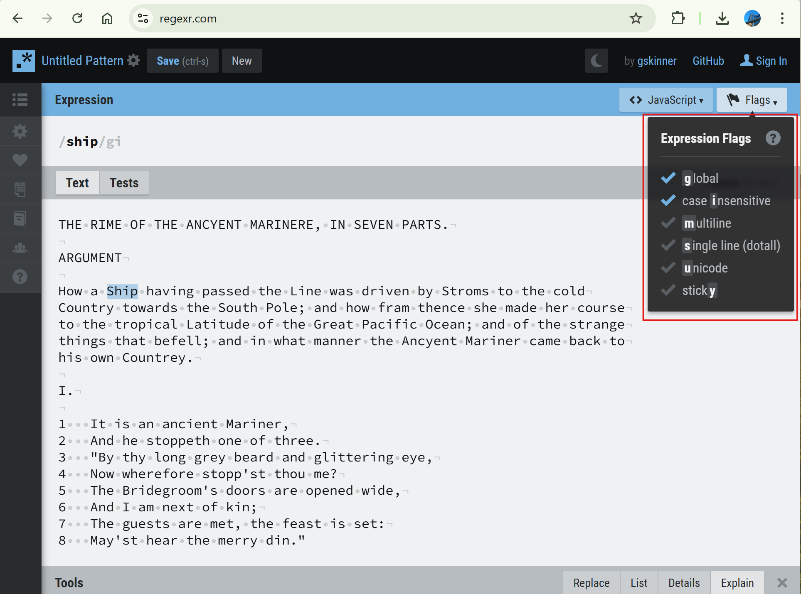

# 02.01 Matching String Literals

By default, regular expressions are case sensitive, as below, click "Flags", check "i" for case insensitive.

You may adjust other Flags to customize variable situations.

---

Date: 2025/05/01